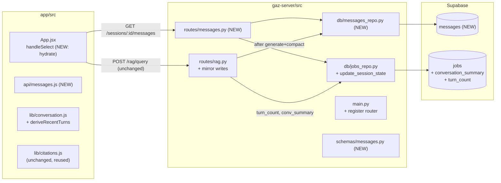

# Persist Chat History (Server-Side)

## Context

Today the server is stateless: `POST /rag/query` is a pure function. The frontend (`app/src/App.jsx`) keeps `messagesBySession` and `historyBySession` in React state only — no localStorage, no DB. On refresh, the conversation evaporates. `summary.md:168` flags this as the next deliberate step: *"Show and store chat history: create a separate table in supabase to store past conversations and reference them as and when needed."*

Goal: survive refresh and session-switch with **minimal disruption** and **zero risk to existing data**. Reliability over polish, per Gazelle's V1 philosophy.

This plan is the source of truth for the work. **Step 0 of execution is to commit a copy of this file to `plan/new features/chat history.md` on the feature branch** (the file space-name is intentional; matches the user's requested layout). It must be followed rigorously — anything not described here is out of scope; deviations require updating this plan first.

## Shape of the change



## Branching & workflow

- **Off `main`, not the current branch.** Current branch is `feature/summary-intent-routing`; do not stack on it.
- New branch name: `feature/persist-chat-history`.
- All commits land on this branch. No pushes to `main` until the plan's verification section passes end-to-end on staging.
- Commit cadence: at least one commit per "phase" (migration → repo → endpoint → FE → docs), so any revert is granular.
- Open a PR early as a draft so CI / preview deploys exercise the branch.

## Magnitude

**Small-to-medium, fully additive.** ~1 SQL migration, ~1 new repo file, ~1 new endpoint, ~1 modified endpoint (`rag.py`), ~1 new FE API helper, ~30 lines in `App.jsx`. Roughly **200–300 LOC**, no breaking changes, no client migration story.

Does **not** change:
- The `RagRequest` / `RagResponse` Pydantic schemas (`gaz-server/src/schemas/rag.py`) — client keeps sending `turn_count`, `conversation_summary`, `recent_turns`.
- The RAG pipeline (`augment → embed → search → generate → compact`).
- The `jobs` identity model (`session_id == job_id`).
- Auth (none today, none added; persistence scoped by `session_id`, like every other endpoint).

## Approach: backend mirrors writes, client remains live owner

- Backend silently persists each user + assistant turn to Supabase inside `/rag/query`, plus `turn_count` / `conversation_summary` on `jobs`.
- Client keeps owning live state — **no behavioral change to `handleSend`**.
- On session switch / refresh, FE calls `GET /sessions/{id}/messages` to hydrate `messagesBySession[sid]` and `historyBySession[sid]`. Wire change is one fetch in `handleSelect`.

## DO — concrete tasks, in execution order

### Phase 1 — Branch + plan doc
1. `git checkout main && git pull && git checkout -b feature/persist-chat-history`.
2. Copy this plan to `plan/new features/chat history.md` (note the space in the directory name — exact path requested), commit: *"docs: add chat-history persistence plan"*.

### Phase 2 — Migration (forward + rollback)

**Forward — `gaz-server/src/db/migrations/002_chat_history.sql`** (match style of `001_add_summary_json.sql` — idempotent, IF NOT EXISTS):

```sql
-- Migration 002: persist chat history.
-- Safe to re-run. Reversible via 002_chat_history_rollback.sql.

create table if not exists messages (
  id          uuid primary key default gen_random_uuid(),
  session_id  uuid not null references jobs(id) on delete cascade,
  role        text not null check (role in ('user', 'assistant')),
  content     text not null,
  citations   jsonb not null default '[]'::jsonb,
  language    text,
  created_at  timestamptz not null default now()
);

create index if not exists messages_session_idx on messages (session_id, created_at);

alter table jobs add column if not exists conversation_summary text;
alter table jobs add column if not exists turn_count int not null default 0;
```

**Rollback — `gaz-server/src/db/migrations/002_chat_history_rollback.sql`** (committed alongside the forward script so it is in git history and reviewable):

```sql
-- Rollback for 002_chat_history.sql. Only run if you need to fully undo persistence.
-- WARNING: dropping `messages` deletes all persisted chat history. Take a SQL dump first.
drop table if exists messages;
alter table jobs drop column if exists turn_count;
alter table jobs drop column if exists conversation_summary;
```

**Doc update**: also update `plan/hosting/hosting.md §6.2` (~line 168) to reflect the new table + columns, so anyone re-bootstrapping a fresh Supabase project gets the right schema.

### Phase 3 — Backend

#### New: `gaz-server/src/db/messages_repo.py`
Mirror `jobs_repo.py` (plain functions, dict in / dict out).

```python
TABLE = "messages"

def insert_message(session_id, role, content, citations=None, language=None) -> dict: ...
def list_messages(session_id) -> list[dict]: ...   # order by created_at asc
```

#### Modified: `gaz-server/src/db/jobs_repo.py`
Add one helper. Only writes keys explicitly passed — so it cannot accidentally null `conversation_summary` on non-compaction turns.

```python
def update_session_state(job_id: str, *, conversation_summary: str | None = None,
                         turn_count: int | None = None) -> None:
    update: dict = {}
    if conversation_summary is not None: update["conversation_summary"] = conversation_summary
    if turn_count is not None: update["turn_count"] = turn_count
    if not update: return
    supabase_client.get().table(TABLE).update(update).eq("id", job_id).execute()
```

#### Modified: `gaz-server/src/routes/rag.py`

Two insertion sites, both **before** their respective `return`s.

1. **Refusal path** (currently `rag.py:115-133`): persist `("user", req.query_text)` and `("assistant", refusal_text, citations=[], language=aug["query_language"])`; bump `turn_count` to `req.turn_count + 1`. Don't touch `conversation_summary`.
2. **Happy path** (after step 6 compact, before `return` at `rag.py:156`): persist user turn, then assistant turn with `citations=[c.model_dump() for c in citations]` and `language=aug["query_language"]`. Then `update_session_state(sid, turn_count=req.turn_count + 1, conversation_summary=new_summary)` — `new_summary` is None on non-compaction turns, the helper skips it.

**Failure policy for persistence writes: best-effort + log, do not fail the request.** Wrap the insert block in a `try/except` that logs the exception (`log.exception("persistence.write_failed", ...)`) and returns the response anyway. Rationale: the client already has the live state in memory; a transient Supabase blip should degrade hydrate-after-refresh, not break the in-progress chat. Make this stance explicit in a comment.

#### New: `gaz-server/src/schemas/messages.py`
Mirror `schemas/rag.py`. Reuse `Citation` and `Language` literals from `schemas.rag`.

```python
class PersistedMessage(BaseModel):
    id: str; role: Literal["user","assistant"]; content: str
    citations: list[Citation] = []; language: Optional[Language] = None
    created_at: str

class MessagesListResponse(BaseModel):
    messages: list[PersistedMessage]
    conversation_summary: Optional[str] = None
    turn_count: int = 0
```

#### New: `gaz-server/src/routes/messages.py`

```python
@router.get("/sessions/{session_id}/messages", response_model=MessagesListResponse)
async def list_session_messages(session_id: str) -> MessagesListResponse:
    job = jobs_repo.get_job(session_id)
    if not job: raise AppError("invalid_session", "This session is no longer available.", 404)
    rows = messages_repo.list_messages(session_id)
    return MessagesListResponse(
        messages=[PersistedMessage(**r, created_at=str(r["created_at"])) for r in rows],
        conversation_summary=job.get("conversation_summary"),
        turn_count=int(job.get("turn_count") or 0),
    )
```

#### Modified: `gaz-server/src/main.py`
Register the new router next to the others (`main.py:19, 76-82`).

### Phase 4 — Frontend

#### New: `app/src/api/messages.js`
```js
import { request } from "./client.js";
export const listMessages = (sid) => request(`/sessions/${sid}/messages`);
```

#### Modified: `app/src/lib/conversation.js`
Add a sibling to `updateHistory`:

```js
export function deriveRecentTurns(messages) {
  return messages.slice(-MAX_RECENT_MESSAGES).map((m) => ({
    role: m.role,
    content: m.role === "user" ? m.text : m.responseText,
  }));
}
```

#### Modified: `app/src/App.jsx`
One helper + one hook into `handleSelect`. **No change to `handleSend`.**

1. Import `listMessages`, `deriveRecentTurns`. Add `const hydratedSessions = useRef(new Set())` so we fetch at most once per session per page-load.
2. In `handleSelect(id)` at `App.jsx:109`, when `s.status === "ready"` and id is not in `hydratedSessions.current`, fetch + populate both state slices. Adapt rows via a local `toFrontendMessage(m)` helper that uses the existing `tokenizeWithCitations` + `adaptCitation` from `app/src/lib/citations.js`.
3. On hydrate error, `notify("error", "Couldn't load this conversation.")` and leave the in-memory state empty (FE recovers on next send; subsequent `handleSelect` retries the fetch since we only mark hydrated on success).

#### Decision: re-tokenize on hydrate (don't store `parts`)
`tokenizeWithCitations` is deterministic given `content` + `citations`, both stored. Re-tokenize on hydrate. Avoids schema churn if tokenizer evolves and keeps one source of truth.

### Phase 5 — Optional but recommended: surface `last_activity_at`

`App.jsx:66` already seeds `last_activity_at` from `created_at` and updates it on send, but the server doesn't return it. The `jobs.updated_at` trigger (`hosting.md:200-206`) already runs on every update.

- Add `updated_at` to the `select` in `jobs_repo.list_sessions()` (`jobs_repo.py:41`).
- Add `last_activity_at: Optional[str]` to `SessionRow` (`schemas/jobs.py:34`).
- Map `r["updated_at"] → last_activity_at` in `routes/sessions.py:13`.

~5 lines. Sidebar ordering then reflects real chat activity post-refresh. If sidebar reordering feels out of scope, drop this phase — it does not affect persistence correctness.

## DO NOT — explicit non-goals & forbidden moves

- **Do NOT** modify the `RagRequest` / `RagResponse` schemas. Backward compatibility with the live client is non-negotiable for this change.
- **Do NOT** change `handleSend` in `App.jsx`. The two-tier client history machinery stays exactly as is.
- **Do NOT** delete `feature/summary-intent-routing` or rebase it onto this branch.
- **Do NOT** add auth, RLS policies, or row-level scoping. Persistence is per-session, identical security posture to today's endpoints.
- **Do NOT** persist the rendered `parts` array. Store `content` + `citations`; re-tokenize on hydrate.
- **Do NOT** add IndexedDB/localStorage caches on the FE. Explicitly out per `fe-plan.md`.
- **Do NOT** stream responses or add SSE in this PR.
- **Do NOT** drop or rename any existing column on `jobs`. We only **add**. Two new nullable/defaulted columns is the entire `jobs` change.
- **Do NOT** run the rollback migration on production without a SQL dump of `messages` first.
- **Do NOT** mark hydrate as "fail-loud" — best-effort with logged exceptions, so transient DB issues degrade hydrate, not live chat.
- **Do NOT** add automated tests if there is no pre-existing harness; manual curl + browser walkthroughs are the verification surface for V1. (If we ever add pytest/vitest, this is a fine first feature to cover — but not in this PR.)
- **Do NOT** edit `web-ui/` for any reason — it's the frozen design artifact (`CLAUDE.md`).

## Blast radius

| Surface | What can break | Likelihood | Worst case |
|---|---|---|---|
| `jobs` table (existing data) | Two `ADD COLUMN IF NOT EXISTS` statements with safe defaults. Cannot lose data. | Very low | Migration partially applied; rerun is safe. |
| `messages` table (new) | New empty table; nothing depends on it pre-deploy. | N/A | Drop and recreate. |
| `routes/rag.py` | New insert calls inside the existing handler. Best-effort wrapper ensures they cannot fail the request. | Low | Insertions silently fail → hydrate is empty for the affected turns; live chat unaffected. |
| `routes/messages.py` (new) | Net-new endpoint; nothing else routes to it. | N/A | 500 from a bad row → handled by global error handler; FE shows toast. |
| `routes/sessions.py` (if `last_activity_at` phase included) | Add a new optional field to the response. FE already tolerates absence (`App.jsx:66`). | Very low | Field missing → fallback to `created_at`. |
| `App.jsx` | New hydration path on session switch; gated by `useRef` to fire at most once per session per page-load. | Low | Hydrate fetch errors → toast, empty chat; live chat unaffected. |
| Qdrant | Untouched. | N/A | — |
| External APIs (OpenAI/Groq) | Untouched. | N/A | — |

**Worst realistic case:** the migration is applied to production Supabase, the code change has a bug, and `/rag/query` starts 500ing. Recovery: revert the code commit on Render (instant rollback via the Render dashboard, see Deploy section). The DB schema additions are inert — no need to roll the DB back to restore service. Roll back the DB only if you also need to remove the (additive) columns; existing rows are untouched either way.

## Rollback / "something went wrong" runbook

Pick the smallest action that fixes the symptom.

### A. Code is broken but DB is fine (most likely)
1. **Render dashboard** → `gazelle-backend` → **Deploys** → find the prior deploy → **"Rollback to this deploy"**. Promotion is ~30 sec.
2. On the feature branch: `git revert <bad-commit>` and push. Render redeploys.
3. Frontend (Vercel) is hosted independently — roll back via Vercel's deployment history if the FE change is also at fault.

### B. Migration applied, want to keep the columns but stop using them
Just revert the code. The schema additions are dormant; `messages` stays empty going forward, `jobs.conversation_summary` / `jobs.turn_count` stop being written. No cleanup needed.

### C. Need to fully unwind the schema (rare — only if a column conflicts or we want a clean slate)
1. In Supabase Dashboard → **Database** → **Backups** → take a manual snapshot first. (Or run `pg_dump --table=jobs --table=messages` via the connection string locally.)
2. Run `002_chat_history_rollback.sql` in the SQL editor. Confirms: `messages` gone; `jobs` has no `conversation_summary` / `turn_count`.
3. Restore from the snapshot only if rollback itself misbehaves.

### D. Data corruption in `messages` (e.g., malformed `citations` JSONB from a bad write)
- Inspect: `select id, session_id, role, jsonb_typeof(citations) from messages where jsonb_typeof(citations) != 'array' limit 50;`
- Repair narrowly: `update messages set citations = '[]'::jsonb where id in (...);`
- If the bad rows are recent and isolated to one session, the cleanest fix is `delete from messages where session_id = '<id>';` — the user loses one chat history, not all.
- **Never** issue an unscoped `delete from messages` or `update messages set ...` without a `where`.

### E. Pre-migration backup recipe (run before applying 002 in staging or prod)
```bash
# Connection string from Supabase → Settings → Database → "URI"
pg_dump "$SUPABASE_DB_URL" --table=public.jobs --data-only --file=backup_jobs_pre_002.sql
```
`jobs` is the only table at risk (additions are non-destructive, but a dump is cheap insurance). `messages` does not exist yet, so nothing to back up.

## Test cases

No pytest/vitest harness exists today (verified in `requirements.txt` and `package.json`). Tests are **manual curl + browser walkthroughs** for this PR, consistent with V1's "ship the happy path" philosophy. Each case is a checklist item; check them off in the PR description.

### New-functionality cases

- [ ] **N1 — Migration is idempotent.** Apply `002_chat_history.sql` to staging Supabase twice in a row. Second run is a no-op (no errors). Verify `messages` table exists and `jobs` has the two new columns via Table Editor.
- [ ] **N2 — Happy-path write.** Against a `status='ready'` session, `POST /rag/query` with `turn_count=0`. After response:
  - `select count(*) from messages where session_id='<sid>'` → 2 (user + assistant).
  - Assistant row has non-empty `citations` JSONB array and `language` matching `response.language`.
  - `select turn_count, conversation_summary from jobs where id='<sid>'` → `turn_count=1`, `conversation_summary` still null.
- [ ] **N3 — Compaction write.** Send 4 turns. After the 4th: `jobs.conversation_summary` is populated (non-null), `jobs.turn_count=4`. `messages` count = 8.
- [ ] **N4 — Refusal persistence.** Force a refusal (e.g., off-topic query on a detail-only video). Confirm 2 rows added (user + assistant refusal text) and `turn_count` still bumps.
- [ ] **N5 — Hydrate endpoint shape.** `curl GET /sessions/<sid>/messages | jq` returns `{messages: [...], conversation_summary: ..., turn_count: ...}` with messages ordered by `created_at` ascending. Citations on assistant rows are arrays.
- [ ] **N6 — Hydrate 404.** `curl GET /sessions/00000000-0000-0000-0000-000000000000/messages` returns 404 with `error.code = "invalid_session"`.
- [ ] **N7 — FE refresh survives.** In the browser, send a turn on a fresh session, hard-refresh (Cmd-Shift-R), click the session in the sidebar. Messages render with citations clickable and correct language badge.
- [ ] **N8 — FE compaction across refresh.** Send 5 turns, refresh, send the 6th turn. Backend `query.augmented` log shows non-null `conversation_summary` carried into the augment step (proves hydrate populated `historyBySession`).
- [ ] **N9 — Hydrate fires at most once.** Click a session, switch away, click back. Network panel shows exactly one `GET /sessions/.../messages` per session per page-load.
- [ ] **N10 — Persistence failure is non-fatal.** Temporarily set `SUPABASE_KEY` to an invalid value locally; `POST /rag/query` still returns a 200 with the answer. Server logs include `persistence.write_failed`. (Restore the key after.)
- [ ] **N11 — `last_activity_at`** (only if Phase 5 included): send a turn on session A, refresh, sidebar lists A first.

### Regression cases (must still pass)

- [ ] **R1 — `/rag/query` response shape unchanged.** Diff a sample response against a baseline captured before the change: `response`, `conversation_summary`, `citations` fields identical in name, type, ordering.
- [ ] **R2 — Summary intent still works.** Ask "summarize the lecture" on a known ready session; `summary_json` either lazily generates or loads from cache; response is non-empty; new `messages` rows are inserted.
- [ ] **R3 — Thematic intent still works.** Ask a broad thematic question; both `document_summary` and retrieved citations land in the response; mirror writes still fire.
- [ ] **R4 — Detail intent still works.** Ask a specific fact-lookup question; citations array non-empty; mirror writes still fire.
- [ ] **R5 — Refusal path still works.** Off-topic query returns the canonical refusal text in the right language; mirror writes fire (see N4).
- [ ] **R6 — Session list unchanged.** `GET /sessions` returns the same shape it does today (modulo the optional `last_activity_at` field which the FE already tolerates).
- [ ] **R7 — Archive / delete still work.** Archive and delete a session via the sidebar. For delete: `select * from messages where session_id='<sid>'` returns zero rows (cascade fired).
- [ ] **R8 — Ingest pipelines unchanged.** YouTube + upload + paste-transcript flows all reach `status='ready'`; processing UI advances through stages as before.
- [ ] **R9 — CORS unchanged.** FE in browser successfully talks to BE (`ALLOWED_ORIGINS` config untouched).
- [ ] **R10 — Existing sessions hydrate empty.** A session created before the deploy hydrates with an empty `messages` array and `turn_count=0`. Sending a new turn from that session works and starts populating `messages` from that point.

## Local verification

Prereqs: a Supabase **staging** project (separate from prod), Qdrant cluster, `.env` in `gaz-server/`, `.env` in `app/`.

1. **Branch:** `git checkout -b feature/persist-chat-history` off `main`.
2. **Apply forward migration on staging Supabase:** Dashboard → SQL Editor → paste `002_chat_history.sql` → Run. Confirm via Table Editor.
3. **Run backend:**
   ```bash
   cd gaz-server && pip install -r requirements.txt
   uvicorn src.main:app --reload --port 8000
   ```
   Confirm `startup.complete` in logs.
4. **Run frontend:**
   ```bash
   cd app && npm install && npm run dev
   ```
   Open the printed `http://localhost:5173`.
5. **Walk through N1–N10** in the test-cases section against `localhost:8000`. Curl examples for N2/N5/N6 in the PR description.
6. **Walk through R1–R10** as a regression pass on the same staging DB.
7. **If anything in N1–N11 or R1–R10 fails**, do not push to `main`. Fix on the feature branch, repeat from step 5.

## Render deploy

Backend is on Render (`plan/hosting/hosting.md §10`), Docker-based, with `gazelle-backend` web service. Health check path is `/sessions` — if our changes break that endpoint, the deploy goes red automatically and traffic isn't promoted.

### Deploy steps
1. **Apply migration on production Supabase** (Dashboard → SQL Editor → run `002_chat_history.sql`). Do this **before** the code deploy so the new code never queries against a missing table.
2. **Take a `jobs` dump** (see Rollback recipe E) and save it locally.
3. **Push the feature branch** to GitHub. Open PR against `main`.
4. Once approved, **merge to `main`**. Render auto-deploys on push to `main` (per `hosting.md`). Watch **Render → gazelle-backend → Logs** during the ~3–4 min Docker rebuild.
5. **Vercel** auto-deploys `app/` from `main` similarly.
6. **Smoke-test on production:**
   - `curl https://gazelle-backend.onrender.com/sessions` → 200, JSON.
   - In the production FE: open an existing session, send a new turn, refresh, confirm the turn survives.
   - Confirm a new row pair in `messages` via Supabase Dashboard.
7. **If smoke fails**, follow the Rollback runbook (A in most cases — Render's "Rollback to this deploy" button is the fastest path).

### Render-specific gotchas
- Render free tier spins down after 15 min idle — first request takes 30–60s. This is unrelated to persistence; surface it in PR notes so testers don't flag it as a regression.
- Health-check path is `/sessions` (`hosting.md:415`). Our changes don't touch it. If we add the `last_activity_at` field (Phase 5), make sure the schema change doesn't break the response — extra fields are FE-tolerated, so this is safe.
- `ALLOWED_ORIGINS` env var is unchanged. CORS is unchanged.
- No new env vars are introduced by this feature. Nothing to set in Render's dashboard.

## Critical files (final inventory)

Backend:
- `gaz-server/src/routes/rag.py:115-160` — insert writes in refusal + happy paths, wrap best-effort
- `gaz-server/src/db/jobs_repo.py` — add `update_session_state`
- `gaz-server/src/schemas/rag.py:23-41` — reuse `Citation`, `Language` in new schema
- `gaz-server/src/main.py:19,82` — register new router
- New: `gaz-server/src/db/messages_repo.py`
- New: `gaz-server/src/routes/messages.py`
- New: `gaz-server/src/schemas/messages.py`
- New: `gaz-server/src/db/migrations/002_chat_history.sql`
- New: `gaz-server/src/db/migrations/002_chat_history_rollback.sql`
- Docs: `plan/hosting/hosting.md §6.2` (update schema source-of-truth)
- Docs (new): `plan/new features/chat history.md` (this plan, copied verbatim)

Frontend:
- `app/src/App.jsx:109` — `handleSelect` hydration call (+ `useRef` for `hydratedSessions`)
- `app/src/lib/conversation.js:16` — add `deriveRecentTurns`
- `app/src/lib/citations.js` — reused as-is
- New: `app/src/api/messages.js`
